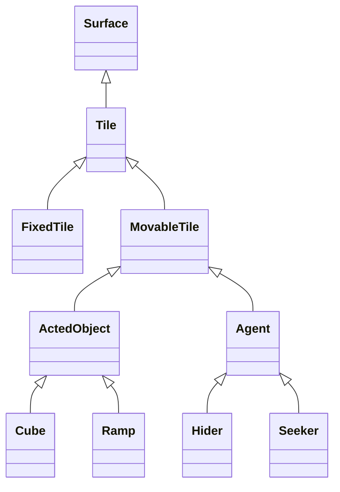

# Overview

The purpose of the *hide-and-seek* program is to bring entertainment through a simple game. It will integrate graphical and sound interfaces, event processing (keyboard and mouse), game logic, and network communication. This 2-dimensional game is inspired by the [OpenAI research work](https://openai.com/research/emergent-tool-use) where hiders and seekers compete to find new strategies and adapt to new situations. The game begins with *sleeping* seekers, allowing hiders to rearrange digital objects in their favor. As soon as seekers wake up, they start to look for the hiders and can create new strategies to find them. During the game,  agents cannot see through objects, like blocks or walls so each player will see black areas rendered on the screen depending on the agent's position. The game ends when a hider is in the seeker's range of vision or when the seeker cannot find the hider after a certain time. This software also serves as a renderer for [my next project]() on reinforcement learning.

# How it works

The *hide-and-seek* program relies on [PyGame](https://www.pygame.org/). This code creates a platform game by using icons (or *tile* in the code) to build walls, movable blocks, and *agents*. An agent can be of type *seeker* or *hider*, and they respond to keyboard events. An agent cannot see through the walls or blocks, so a seeker will need to move ramps to see the other side of the wall, and hiders will need to use blocks smartly. Several features are still in development. The chart below shows an overview of the class relationships.



When the user quits the program, it will automatically save hider and seeker moves (files `seeker.txt` and `hider.txt`). These files will be loaded and the previous game will be recreated and rendered on the screen at the beginning of the next session. Since the files are human-readable, this feature allows developers to experiment and can be used as a renderer for similar console/terminal-based games.

A demonstration of the software running and a walkthrough of the code can be found [here](https://youtu.be/IKunGsytlXI).


# How to use it

Assuming Python and pip are installed on your machine, clone this repository

```console
$ git clone https://github.com/chinchay/hide-and-seek.git
```


and run the game

```console
$ python game.py
```

Seeker will respond to keys &#8593; (up move),  &#8595; (down move), &#8592; (left move),  &#8594; (right move), while hider will respond to `Command` + `s` (up move), `x` (down move), `z` (left move), and `c` (right move). At this stage, both hider and seeker are played in the same machine.


# Development Environment

* __Editor__: Visual Studio Code
* __Language__: Python 3.10.5
* __Version control system__: Git
* __Cloud repository__: GitHub
* __Python packages__: [PyGame](https://www.pygame.org/)

Pygame was chosen over [Python Arcade](https://api.arcade.academy/en/latest/) because game rendering through a [Docker](https://www.docker.com/) container has been succesfully achieved via Pygame and [XQuartz](https://www.xquartz.org/) on a Mac machine.  Future developments will include this feature.

# Useful Websites

__Video demonstrations__
* [Pygame Tile Based Game Tutorial: Tilemaps](https://www.youtube.com/watch?v=37phHwLtaFg&pp=ygULcHlnYW1lIHRpbGU%3D&ab_channel=CDcodes)


__Simulate events__
* [pygame.event](https://www.pygame.org/docs/ref/event.html)

__Buiding a map of tiles from file__
* [Machine learning is fun](https://medium.com/@ageitgey/machine-learning-is-fun-part-2-a26a10b68df3)

__For future development__
* [Running Pygame in a Docker container (MacOS)](https://opeonikute.dev/posts/running-pygame-in-a-docker-container-macos)
* [xquartz](https://www.xquartz.org/)
* [How to show X11 windows with Docker on Mac](https://medium.com/@mreichelt/how-to-show-x11-windows-within-docker-on-mac-50759f4b65cb)
* [Running GUI applications using Docker for Mac](https://sourabhbajaj.com/blog/2017/02/07/gui-applications-docker-mac/)


# Future work
* Improve code performance to hide tiles behind walls or blocks
* Implement ending game. The game should end when the hider is in the visible range of the seeker
* Allow different machines to connect and play


# Copyright and license

Code released under the MIT License
