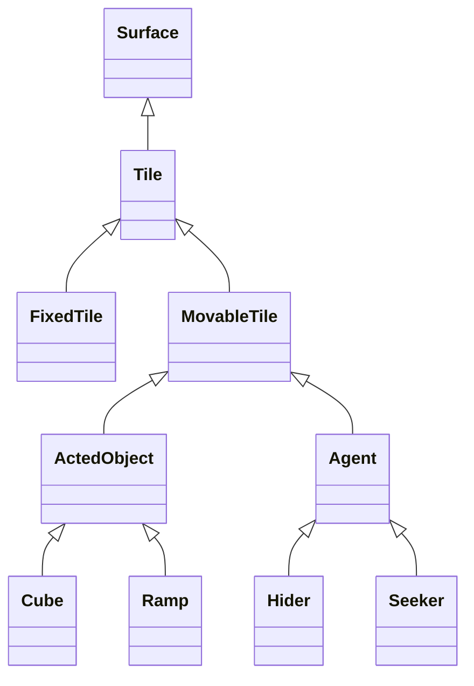

# Classes definition

```mermaid
classDiagram
    Surface <|-- Tile
    Tile <|-- FixedTile
    Tile <|-- MovableTile
    MovableTile <|-- ActedObject
    MovableTile <|-- Agent
    ActedObject <|-- Cube
    ActedObject <|-- Ramp
    Agent <|-- Hider
    Agent <|-- Seeker
```

